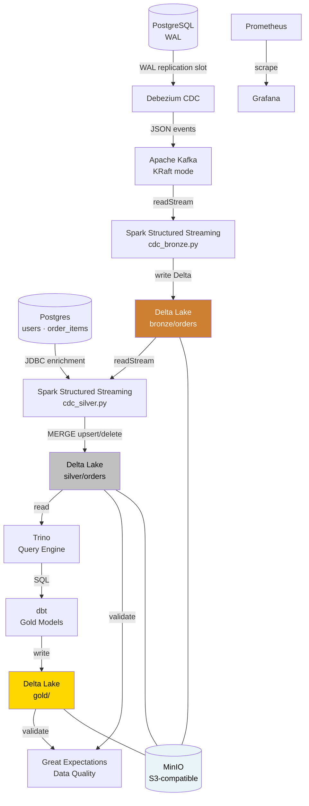

# CDC Pipeline — Real-Time Data Lakehouse

A production-inspired **Change Data Capture** pipeline that streams PostgreSQL row-level changes into a Delta Lake lakehouse, with dbt transformations and full observability via Prometheus and Grafana.

Built entirely with open-source tools and runs locally with a single `docker-compose up`.

---

## Architecture



### Medallion Architecture

| Layer | Path | Description |
|---|---|---|
| 🥉 Bronze | `s3a://lakehouse/bronze/orders` | Raw CDC events — immutable, append-only |
| 🥈 Silver | `s3a://lakehouse/silver/orders` | Enriched and deduplicated via MERGE |
| 🥇 Gold | `s3a://lakehouse/gold/` | Business aggregations built by dbt via Trino |

---

## Stack & Design Choices

| Component | Technology | Why |
|---|---|---|
| Source DB | PostgreSQL 16 | `wal_level=logical` enables native CDC via replication slots |
| CDC | Debezium 2.5 | Zero-latency change capture directly from WAL — no polling, no DB load |
| Message broker | Kafka 7.8 (KRaft) | Removes ZooKeeper dependency; standard in Kafka 3.x+ |
| Stream processing | Spark 4.0 + Structured Streaming | Micro-batch with exactly-once semantics via Delta checkpointing |
| Storage | Delta Lake 4.0 on MinIO | ACID transactions, time travel, schema evolution — S3-compatible locally |
| Query engine | Trino 435 | Distributed SQL engine bridging dbt and Delta Lake on MinIO |
| Transformations | dbt + dbt-trino | SQL-first, testable, version-controlled Gold models |
| Data quality | Great Expectations 0.18 | Automated validation of Silver and Gold layers with Data Docs |
| Observability | Prometheus + Grafana | Consumer lag, throughput, and pipeline health metrics |
| Containerization | Docker Compose | Full local setup in one command |

**Why CDC instead of batch ETL?**
Traditional ETL polls the source database on a schedule, introducing latency and DB load. Debezium reads the PostgreSQL Write-Ahead Log directly — the same mechanism used for replication — capturing every row change in real time with no impact on the source.

**Why Delta Lake instead of raw Parquet?**
Raw Parquet has no ACID guarantees: a failed Spark job can leave partial files with no way to roll back. Delta Lake wraps Parquet with a transaction log, giving us atomic writes, idempotent upserts (MERGE), and time travel for free.

---

## Project Structure

```
CDCpipeline/
├── docker-compose.yaml          # Full local environment
├── dockerfile                   # Custom Spark image with Delta + Kafka JARs
├── requirements.txt             # Python dependencies (GE, delta-spark, psycopg2)
├── debizium_api.bash            # Debezium connector registration script
├── spark_apps/                  # PySpark streaming jobs
│   ├── cdc_bronze.py            # Kafka → Delta Lake (Bronze)
│   ├── cdc_silver.py            # Bronze → Silver with JDBC enrichment
│   ├── silver_transforms.py     # Pure enrichment function (testable)
│   └── tests/                   # Unit and integration tests
├── great_expectations/          # Data quality
│   ├── great_expectations.yml   # GE configuration
│   ├── validate.py              # Validation script (Silver + Gold)
│   └── expectations/            # Expectation suites (Silver, Gold)
├── trino/                       # Trino query engine config
│   ├── config.properties
│   ├── node.properties
│   ├── jvm.config
│   ├── init.sql                 # Delta table registration
│   └── catalog/delta.properties # Delta Lake connector
├── dbt_project/                 # dbt Gold layer
│   ├── profiles.yml             # Trino connection
│   ├── dbt_project.yml
│   └── models/gold/             # Gold SQL models + schema tests
├── init-db/                     # PostgreSQL init scripts
├── prometheus/                  # Prometheus scrape configuration
├── minio-policies/              # MinIO lifecycle policies
└── .pre-commit-config.yaml      # Code quality hooks
```

---

## Prerequisites

- Docker & Docker Compose v2
- ~6 GB RAM available (Spark master + worker + Kafka + Postgres)

---

## Quickstart

**1. Clone and configure environment**

```bash
git clone https://github.com/ProductAnalyticsProjects/CDCpipeline.git
cd CDCpipeline
cp .env.example .env          # edit credentials if needed
```

**2. Start all services**

```bash
docker compose up -d
```

Wait ~30 seconds for all healthchecks to pass, then verify:

```bash
docker compose ps              # all services should show "healthy" or "running"
```

**3. Register the Debezium connector**

```bash
bash debizium_api.bash
```

This registers the PostgreSQL connector, which immediately begins capturing changes from the `public.orders` table.

**4. Submit the Spark streaming job**

```bash
docker exec spark-master \
  /opt/spark/bin/spark-submit \
  --master spark://spark-master:7077 \
  /opt/spark/apps/<your_job>.py
```

**5. Run dbt transformations**

```bash
docker compose run --rm dbt run
docker compose run --rm dbt test
```

---

## Service URLs

| Service | URL | Credentials |
|---|---|---|
| Kafka UI | http://localhost:8080 | — |
| Spark Master UI | http://localhost:8081 | — |
| Debezium REST API | http://localhost:8083 | — |
| Trino | http://localhost:8084 | — |
| MinIO Console | http://localhost:9001 | see `.env` |
| Grafana | http://localhost:3000 | see `.env` |
| Prometheus | http://localhost:9090 | — |
| pgAdmin | http://localhost:5050 | see `.env` |

---

## Data Flow in Detail

1. **Postgres → Debezium**: WAL logical replication slot feeds row-level events (op: `c/u/d/r`) to Debezium
2. **Debezium → Kafka**: Each table maps to a Kafka topic (`fullfillment.public.orders`)
3. **Kafka → Spark**: Spark Structured Streaming reads from Kafka with `startingOffsets=earliest`, processes micro-batches
4. **Spark → Delta Lake**: Writes to MinIO bucket `lakehouse/` using Delta format with checkpointing for fault tolerance
5. **Delta → dbt**: dbt models query Delta tables and produce analytics-ready views back into Postgres (or the lakehouse)

---

## Observability

Prometheus scrapes metrics from the Spark JMX exporter and Kafka JMX. Grafana dashboards cover:

- Kafka consumer lag per topic/partition
- Spark streaming batch duration and throughput (rows/s)
- MinIO storage utilization

---

## Known Limitations & Future Work

- **Schema Registry not implemented**: Debezium currently serializes events as JSON. In production, Avro + Confluent Schema Registry (or Apicurio) would enforce schema contracts and reduce payload size.
- **Single Spark worker**: Resource constraints for local dev. In production, the worker pool would scale horizontally.
- **No CI/CD pipeline**: GitHub Actions workflow for linting, dbt tests, and Docker build validation is a planned addition.
- **Secret management**: Credentials are managed via `.env` file. Production deployments should use Docker Secrets, Vault, or a cloud KMS.

---

## Tech Versions

| Tool | Version |
|---|---|
| PostgreSQL | 16 |
| Kafka (Confluent) | 7.8.3 |
| Debezium | 2.5 |
| Apache Spark | 4.0.0 |
| Delta Lake | 4.0.0 |
| Trino | 435 |
| dbt-trino | 1.7.0 |
| Great Expectations | 0.18.19 |
| MinIO | RELEASE.2025-09-07T16-13-09Z |

---

## Contributi

Il repo copre due parti distinte del sistema, scritte da persone diverse:

| Area | Autore |
|---|---|
| `e-commerce/` (backend Spring Boot, frontend React) — l'app che genera gli eventi | [Alessio Novi](https://github.com/AlessioNovi) |
| `spark_apps/`, `dbt_project/`, `trino/`, `great_expectations/`, `dags/`, `.github/` — la pipeline CDC che li consuma | [Pascal](https://github.com/Bolinmea) |

---

## License

[MIT](LICENSE)
