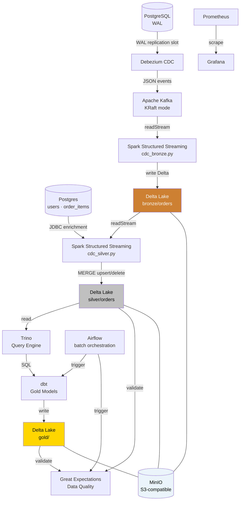

# CDC Pipeline — Real-Time Data Lakehouse

A production-inspired **Change Data Capture** pipeline that streams PostgreSQL row-level changes into a Delta Lake lakehouse, with dbt transformations and full observability via Prometheus and Grafana.

Built entirely with open-source tools and runs locally with a single `docker-compose up`.

---

## Architecture



### Medallion Architecture

| Layer | Path | Description |
|---|---|---|
| 🥉 Bronze | `s3a://lakehouse/bronze/orders` | Raw CDC events — immutable, append-only |
| 🥈 Silver | `s3a://lakehouse/silver/orders` | Enriched and deduplicated via MERGE |
| 🥇 Gold | `s3a://lakehouse/gold/` | Business aggregations built by dbt via Trino |

---

## Stack & Design Choices

| Component | Technology | Why |
|---|---|---|
| Source DB | PostgreSQL 16 | `wal_level=logical` enables native CDC via replication slots |
| CDC | Debezium 2.5 | Zero-latency change capture directly from WAL — no polling, no DB load |
| Message broker | Kafka 7.8 (KRaft) | Removes ZooKeeper dependency; standard in Kafka 3.x+ |
| Stream processing | Spark 4.0 + Structured Streaming | Micro-batch with exactly-once semantics via Delta checkpointing |
| Storage | Delta Lake 4.0 on MinIO | ACID transactions, time travel, schema evolution — S3-compatible locally |
| Query engine | Trino 435 | Distributed SQL engine bridging dbt and Delta Lake on MinIO |
| Transformations | dbt + dbt-trino | SQL-first, testable, version-controlled Gold models |
| Data quality | Great Expectations 0.18 | Automated validation of Silver and Gold layers with Data Docs |
| Observability | Prometheus + Grafana | Consumer lag, throughput, and pipeline health metrics |
| Containerization | Docker Compose | Full local setup in one command |

**Why CDC instead of batch ETL?**
Traditional ETL polls the source database on a schedule, introducing latency and DB load. Debezium reads the PostgreSQL Write-Ahead Log directly — the same mechanism used for replication — capturing every row change in real time with no impact on the source.

**Why Delta Lake instead of raw Parquet?**
Raw Parquet has no ACID guarantees: a failed Spark job can leave partial files with no way to roll back. Delta Lake wraps Parquet with a transaction log, giving us atomic writes, idempotent upserts (MERGE), and time travel for free.

---

## Project Structure

```
CDCpipeline/
├── docker-compose.yaml            # Stack principale (Postgres, Kafka, Debezium, Spark, MinIO, Trino, dbt, GE, Prometheus, Grafana, backend e-commerce)
├── docker-compose.airflow.yml     # Stack Airflow separato (webserver, scheduler, suo Postgres di metadati)
├── docker-compose.ci.yml          # Override usato solo dal job e2e in CI (attiva il seed ADMIN del backend)
├── dockerfile                     # Immagine Spark custom con JAR Delta + Kafka + hadoop-aws
├── airflow/Dockerfile             # Immagine Airflow (requirements-airflow.txt)
├── env.example                    # Template credenziali stack principale (env.airflow.example per Airflow)
├── requirements*.txt              # runtime (GE, delta-spark, psycopg2) · dev (pytest, ruff, pre-commit) · airflow
│
├── spark_apps/                    # PySpark: streaming job e logica pura testabile
│   ├── cdc_bronze.py              # Kafka → Delta Lake (Bronze)
│   ├── cdc_silver.py              # Bronze → Silver, MERGE con guardie di ordinamento
│   ├── bronze_transforms.py       # Decode base64→Decimal, timestamp, tombstone (funzioni pure)
│   ├── silver_transforms.py       # Enrichment JDBC (funzione pura)
│   ├── inspect_bronze.py          # Lettura ad hoc della tabella Bronze
│   ├── spark_bronze.bash          # spark-submit dello stream Bronze
│   ├── spark_silver.bash          # spark-submit dello stream Silver
│   ├── maintenence/               # Delta VACUUM (vacuum.py + start_vacuum.bash)
│   └── tests/                     # pytest: unit sui transforms + integration Kafka
│
├── dags/                          # Airflow
│   ├── cdc_batch_pipeline.py      # dbt run/test + Great Expectations (NON lancia gli stream continui)
│   ├── cdc_maintenance.py         # VACUUM settimanale, DAG separato dalla pipeline batch
│   └── tests/test_dag_integrity.py
│
├── dbt_project/                   # Layer Gold via Trino
│   ├── dbt_project.yml
│   ├── profiles.yml               # Connessione Trino
│   └── models/gold/               # gold_orders_daily · gold_orders_by_status · gold_customer_summary + schema.yml
│
├── great_expectations/            # Data quality
│   ├── great_expectations.yml
│   ├── validate.py                # Validazione Silver + Gold
│   └── expectations/              # silver_orders_suite.json · gold_suite.json
│
├── trino/                         # config/node/jvm.properties, init.sql (registrazione tabelle Delta), catalog/delta.properties
├── debezium/connectors/           # orders.json — config del connector (config-as-code)
├── init-db/init.sql               # Creazione idempotente del DB `ecommerce` (wal_level=logical è nel compose)
├── prometheus/prometheus.yml      # Target di scrape
├── policies/                      # lakehouse_lifecycle.json — lifecycle del bucket MinIO
│
├── scripts/
│   ├── register-debezium-connector.sh   # Registrazione idempotente del connector (PUT)
│   ├── check_postgres_cdc_readiness.sh  # Pre-flight CDC (wal_level, init.sql, replication slot) — usato anche in CI
│   ├── e2e/run_e2e_order_flow.sh        # Ordine reale via API → verifica della riga in Bronze
│   ├── e2e/check_bronze_row.py          # Check della riga in Bronze, gira dentro spark-master
│   ├── setup-branch-protection.sh       # Branch protection su main via API GitHub
│   └── backup-local-untracked.sh        # Backup dei file locali non tracciati
│
├── e-commerce/                    # App sorgente degli eventi: backend Spring Boot + frontend React (vedi Contributi)
│
├── docs/
│   ├── adr/                       # 001 config connector · 002/003 guardie di ordinamento su Silver · 004 rimozione cache enrichment
│   ├── ci-cd.md                   # Come funziona la CI e come riprodurla in locale
│   ├── git-workflow.md            # Branch, PR, conventional commit
│   └── learning/                  # Note di studio (01-kafka-fundamentals.md)
│
├── .github/
│   ├── workflows/ci.yml           # lint · pytest+Spark · dbt parse · compose & versioni · integration · e2e · DAG integrity
│   ├── workflows/docker-build.yml # Build e push dell'immagine Spark su GHCR
│   ├── dependabot.yml
│   └── pull_request_template.md
│
├── ROADMAP.md                     # Fasi verso production-ready, con criteri di uscita
├── CHANGELOG.md                   # Una sezione per fase chiusa
└── .pre-commit-config.yaml        # gitleaks, ruff, hadolint, shellcheck, sqlfluff, conventional-pre-commit
```

> `data/`, `test/` e `great_expectations/data_docs/` sono artefatti di runtime
> locali: gitignorati, non fanno parte del repo.

---

## Prerequisites

- Docker & Docker Compose v2
- ~6 GB RAM available (Spark master + worker + Kafka + Postgres)

---

## Quickstart

**1. Clone and configure environment**

```bash
git clone https://github.com/ProductAnalyticsProjects/CDCpipeline.git
cd CDCpipeline
cp env.example .env           # edit credentials if needed
```

**2. Start all services**

```bash
docker compose up -d
```

Wait ~30 seconds for all healthchecks to pass, then verify:

```bash
docker compose ps              # all services should show "healthy" or "running"
```

**3. Register the Debezium connector**

```bash
bash scripts/register-debezium-connector.sh
```

This registers the PostgreSQL connector (config in `debezium/connectors/orders.json` — see [docs/adr/001-debezium-connector-config.md](docs/adr/001-debezium-connector-config.md) for the rationale behind each setting), which immediately begins capturing changes from the `public.orders` table. The script is idempotent — safe to re-run after changing the config.

**4. Submit the Spark streaming jobs**

I due stream sono processi di lungo periodo: si avviano una volta e restano
vivi dentro `spark-master` (per questo Airflow non li lancia — vedi
`dags/cdc_batch_pipeline.py`).

```bash
docker compose exec -d spark-master /opt/spark/bin/spark-submit --master spark://spark-master:7077 /opt/spark/apps/cdc_bronze.py
```

```bash
docker compose exec -d spark-master /opt/spark/bin/spark-submit --master spark://spark-master:7077 /opt/spark/apps/cdc_silver.py
```

Gli stessi comandi in versione foreground (utile per vedere i log dello
stream) sono in `spark_apps/spark_bronze.bash` e `spark_apps/spark_silver.bash`,
da lanciare dall'host. Verifica che entrambi siano attivi:

```bash
curl -s http://localhost:8081/json/ | jq -r '.activeapps[].name'
```

**5. Run dbt transformations**

```bash
docker compose run --rm dbt run
docker compose run --rm dbt test
```

---

## Service URLs

| Service | URL | Credentials |
|---|---|---|
| Kafka UI | http://localhost:8080 | — |
| Spark Master UI | http://localhost:8081 | — |
| Debezium REST API | http://localhost:8083 | — |
| Trino | http://localhost:8084 | — |
| MinIO Console | http://localhost:9001 | see `.env` |
| Grafana | http://localhost:3000 | see `.env` |
| Prometheus | http://localhost:9090 | — |
| pgAdmin | http://localhost:5050 | see `.env` |
| Backend e-commerce | http://localhost:8085 | — |
| Airflow (stack separato) | http://localhost:8090 | see `env.airflow.example` |
| PostgreSQL | `localhost:1900` | see `.env` |

---

## Data Flow in Detail

1. **Postgres → Debezium**: WAL logical replication slot feeds row-level events (op: `c/u/d/r`) to Debezium
2. **Debezium → Kafka**: Each table maps to a Kafka topic (`fullfillment.public.orders`)
3. **Kafka → Spark**: Spark Structured Streaming reads from Kafka with `startingOffsets=earliest`, processes micro-batches
4. **Spark → Delta Lake**: Writes to MinIO bucket `lakehouse/` using Delta format with checkpointing for fault tolerance
5. **Delta → dbt**: dbt models query Delta tables and produce analytics-ready views back into Postgres (or the lakehouse)

---

## Observability

**Current state:** Prometheus scrapes only the e-commerce backend's Spring
Actuator endpoint (`/api/actuator/prometheus`). Grafana is running but ships
with no provisioned dashboards or datasource — it's an empty shell today,
not a monitoring stack.

**Planned** (see [ROADMAP.md](ROADMAP.md), Fase 7): Kafka consumer lag via
kafka-exporter, Spark streaming batch duration/throughput via a
`StreamingQueryListener`, and — the metric that matters most for a CDC
pipeline — PostgreSQL replication slot lag (`pg_replication_slots`), plus
Grafana dashboards and datasources committed as code, not clicked together
by hand.

---

## Known Limitations & Future Work

- **Schema Registry not implemented**: Debezium currently serializes events as JSON. In production, Avro + Confluent Schema Registry (or Apicurio) would enforce schema contracts and reduce payload size.
- **Single Spark worker**: Resource constraints for local dev. In production, the worker pool would scale horizontally.
- **Airflow è uno stack separato**: `docker-compose.airflow.yml` va avviato a parte e orchestra solo il batch (dbt + GE + VACUUM); gli stream Spark restano processi di lungo periodo avviati a mano.
- **Secret management**: Credentials are managed via `.env` file. Production deployments should use Docker Secrets, Vault, or a cloud KMS.

---

## Tech Versions

| Tool | Version |
|---|---|
| PostgreSQL | 16 |
| Kafka (Confluent) | 7.8.3 |
| Debezium | 2.5 |
| Apache Spark | 4.0.0 |
| Delta Lake | 4.0.0 |
| Trino | 435 |
| dbt-trino | 1.7.0 |
| Great Expectations | 0.18.19 |
| MinIO | RELEASE.2025-09-07T16-13-09Z |

---

## Contributi

Il repo copre due parti distinte del sistema, scritte da persone diverse:

| Area | Autore |
|---|---|
| `e-commerce/` (backend Spring Boot, frontend React) — l'app che genera gli eventi | [Alessio Novi](https://github.com/AlessioNovi) |
| `spark_apps/`, `dbt_project/`, `trino/`, `great_expectations/`, `dags/`, `scripts/`, `docs/`, `.github/` — la pipeline CDC che li consuma | [Pascal](https://github.com/Bolinmea) |

---

## License

[MIT](LICENSE)
