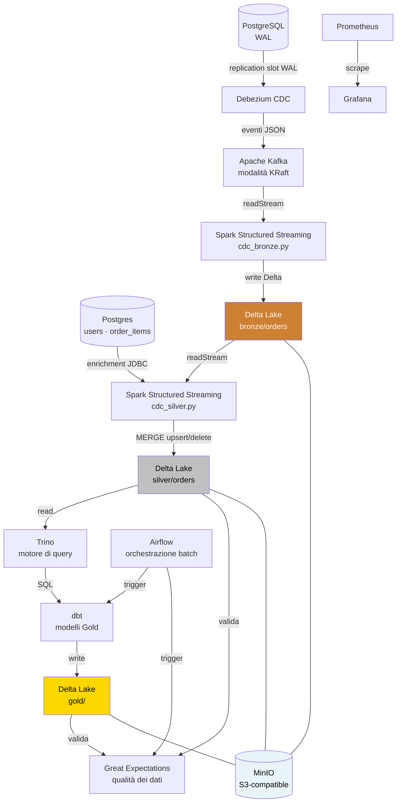

# CDC Pipeline — Real-Time Data Lakehouse

Una pipeline di **Change Data Capture** ispirata a un contesto di produzione:
porta le modifiche riga per riga di PostgreSQL in un lakehouse Delta Lake,
con trasformazioni dbt e osservabilità via Prometheus e Grafana.

Costruita interamente con strumenti open source, girabile in locale con un
solo `docker compose up`.

---

## Architettura



### Architettura Medallion

| Livello | Percorso | Descrizione |
|---|---|---|
| 🥉 Bronze | `s3a://lakehouse/bronze/orders` | Eventi CDC grezzi — immutabili, solo append |
| 🥈 Silver | `s3a://lakehouse/silver/orders` | Arricchiti e deduplicati via MERGE |
| 🥇 Gold | `s3a://lakehouse/gold/` | Aggregazioni di business costruite da dbt via Trino |

---

## Stack e scelte di design

| Componente | Tecnologia | Perché |
|---|---|---|
| DB sorgente | PostgreSQL 16 | `wal_level=logical` abilita il CDC nativo via replication slot |
| CDC | Debezium 2.5 | Cattura le modifiche direttamente dal WAL: nessun polling delle tabelle, nessuna query sulla sorgente |
| Message broker | Kafka 7.8 (KRaft) | Elimina la dipendenza da ZooKeeper; è lo standard da Kafka 3.x |
| Stream processing | Spark 4.0 + Structured Streaming | Micro-batch con semantica exactly-once tramite i checkpoint Delta |
| Storage | Delta Lake 4.0 su MinIO | Transazioni ACID, time travel, schema evolution — S3-compatible in locale |
| Motore di query | Trino 435 | Motore SQL distribuito che fa da ponte tra dbt e Delta Lake su MinIO |
| Trasformazioni | dbt + dbt-trino | SQL-first, testabile, modelli Gold sotto version control |
| Qualità dei dati | Great Expectations 0.18 | Validazione automatica dei livelli Silver e Gold, con Data Docs |
| Osservabilità | Prometheus + Grafana | Consumer lag, throughput e stato di salute della pipeline |
| Containerizzazione | Docker Compose | Ambiente locale completo con un comando |

**Perché CDC e non un ETL batch?**
Un ETL tradizionale interroga il database sorgente a intervalli, introducendo
latenza e carico sul DB. Debezium legge direttamente il Write-Ahead Log di
PostgreSQL — lo stesso meccanismo usato dalla replica — catturando ogni
modifica di riga senza interrogare le tabelle. La latenza non è zero: è la
somma di flush del WAL, poll del connector, hop Kafka e intervallo del
micro-batch Spark. Ma è continua invece che legata a un intervallo di
schedulazione, e il costo sulla sorgente è quello di uno standby in replica,
non di una query analitica. Il valore end-to-end non è ancora misurato — vedi
[ROADMAP.md](ROADMAP.md), Fase 7.

**Perché Delta Lake e non Parquet grezzo?**
Il Parquet grezzo non dà garanzie ACID: un job Spark che fallisce lascia file
parziali senza modo di tornare indietro. Delta Lake avvolge Parquet con un
transaction log, e in cambio si ottengono scritture atomiche, upsert
idempotenti (MERGE) e time travel.

---

## Struttura del progetto

```
CDCpipeline/
├── docker-compose.yaml            # Stack principale (Postgres, Kafka, Debezium, Spark, MinIO, Trino, dbt, GE, Prometheus, Grafana, backend e-commerce)
├── docker-compose.airflow.yml     # Stack Airflow separato (webserver, scheduler, suo Postgres di metadati)
├── docker-compose.ci.yml          # Override usato solo dal job e2e in CI (attiva il seed ADMIN del backend)
├── dockerfile                     # Immagine Spark custom con JAR Delta + Kafka + hadoop-aws
├── airflow/Dockerfile             # Immagine Airflow (requirements-airflow.txt)
├── env.example                    # Template credenziali stack principale (env.airflow.example per Airflow)
├── requirements*.txt              # runtime (GE, delta-spark, psycopg2) · dev (pytest, ruff, pre-commit) · airflow
│
├── spark_apps/                    # PySpark: streaming job e logica pura testabile
│   ├── cdc_bronze.py              # Kafka → Delta Lake (Bronze)
│   ├── cdc_silver.py              # Bronze → Silver, MERGE con guardie di ordinamento
│   ├── bronze_transforms.py       # Decode base64→Decimal, timestamp, tombstone (funzioni pure)
│   ├── silver_transforms.py       # Enrichment JDBC (funzione pura)
│   ├── inspect_bronze.py          # Lettura ad hoc della tabella Bronze
│   ├── spark_bronze.bash          # spark-submit dello stream Bronze
│   ├── spark_silver.bash          # spark-submit dello stream Silver
│   ├── maintenence/               # Delta VACUUM (vacuum.py + start_vacuum.bash)
│   └── tests/                     # pytest: unit sui transforms + integration Kafka
│
├── dags/                          # Airflow
│   ├── cdc_batch_pipeline.py      # dbt run/test + Great Expectations (NON lancia gli stream continui)
│   ├── cdc_maintenance.py         # VACUUM settimanale, DAG separato dalla pipeline batch
│   └── tests/test_dag_integrity.py
│
├── dbt_project/                   # Layer Gold via Trino
│   ├── dbt_project.yml
│   ├── profiles.yml               # Connessione Trino
│   └── models/gold/               # gold_orders_daily · gold_orders_by_status · gold_customer_summary + schema.yml
│
├── great_expectations/            # Qualità dei dati
│   ├── great_expectations.yml
│   ├── validate.py                # Validazione Silver + Gold
│   └── expectations/              # silver_orders_suite.json · gold_suite.json
│
├── trino/                         # config/node/jvm.properties, init.sql (registrazione tabelle Delta), catalog/delta.properties
├── debezium/connectors/           # orders.json — config del connector (config-as-code)
├── init-db/init.sql               # Creazione idempotente del DB `ecommerce` (wal_level=logical è nel compose)
├── prometheus/prometheus.yml      # Target di scrape
├── policies/                      # lakehouse_lifecycle.json — lifecycle del bucket MinIO
│
├── scripts/
│   ├── register-debezium-connector.sh   # Registrazione idempotente del connector (PUT)
│   ├── check_postgres_cdc_readiness.sh  # Pre-flight CDC (wal_level, init.sql, replication slot) — usato anche in CI
│   ├── e2e/run_e2e_order_flow.sh        # Ordine reale via API → verifica della riga in Bronze
│   ├── e2e/check_bronze_row.py          # Check della riga in Bronze, gira dentro spark-master
│   ├── setup-branch-protection.sh       # Branch protection su main via API GitHub
│   └── backup-local-untracked.sh        # Backup dei file locali non tracciati
│
├── e-commerce/                    # App sorgente degli eventi: backend Spring Boot + frontend React (vedi Contributi)
│
├── docs/
│   ├── adr/                       # 001 config connector · 002/003 guardie di ordinamento su Silver · 004 rimozione cache enrichment
│   ├── ci-cd.md                   # Come funziona la CI e come riprodurla in locale
│   ├── git-workflow.md            # Branch, PR, conventional commit
│   └── learning/                  # Note di studio (01-kafka-fundamentals.md)
│
├── .github/
│   ├── workflows/ci.yml           # lint · pytest+Spark · dbt parse · compose & versioni · integration · e2e · DAG integrity
│   ├── workflows/docker-build.yml # Build e push dell'immagine Spark su GHCR
│   ├── dependabot.yml
│   └── pull_request_template.md
│
├── ROADMAP.md                     # Fasi verso production-ready, con criteri di uscita
├── CHANGELOG.md                   # Una sezione per fase chiusa
└── .pre-commit-config.yaml        # gitleaks, ruff, hadolint, shellcheck, sqlfluff, conventional-pre-commit
```

> `data/`, `test/` e `great_expectations/data_docs/` sono artefatti di runtime
> locali: gitignorati, non fanno parte del repo.

---

## Prerequisiti

- Docker e Docker Compose v2
- ~6 GB di RAM disponibili (Spark master + worker + Kafka + Postgres)

---

## Avvio rapido

**1. Clona il repo e configura l'ambiente**

```bash
git clone https://github.com/ProductAnalyticsProjects/CDCpipeline.git
cd CDCpipeline
cp env.example .env           # modifica le credenziali se serve
```

**2. Avvia i servizi**

```bash
docker compose up -d
```

Aspetta ~30 secondi che tutti gli healthcheck passino, poi verifica:

```bash
docker compose ps              # tutti i servizi devono essere "healthy" o "running"
```

**3. Registra il connector Debezium**

```bash
bash scripts/register-debezium-connector.sh
```

Registra il connector PostgreSQL (config in `debezium/connectors/orders.json`
— per il ragionamento dietro ogni singola impostazione vedi
[docs/adr/001-debezium-connector-config.md](docs/adr/001-debezium-connector-config.md)),
che inizia immediatamente a catturare le modifiche della tabella
`public.orders`. Lo script è idempotente: si può rieseguire senza problemi
dopo aver cambiato la config.

**4. Avvia gli stream Spark**

I due stream sono processi di lungo periodo: si avviano una volta e restano
vivi dentro `spark-master` (per questo Airflow non li lancia — vedi
`dags/cdc_batch_pipeline.py`).

```bash
docker compose exec -d spark-master /opt/spark/bin/spark-submit --master spark://spark-master:7077 /opt/spark/apps/cdc_bronze.py
```

```bash
docker compose exec -d spark-master /opt/spark/bin/spark-submit --master spark://spark-master:7077 /opt/spark/apps/cdc_silver.py
```

Gli stessi comandi in versione foreground (utile per vedere i log dello
stream) sono in `spark_apps/spark_bronze.bash` e `spark_apps/spark_silver.bash`,
da lanciare dall'host. Verifica che entrambi siano attivi:

```bash
curl -s http://localhost:8081/json/ | jq -r '.activeapps[].name'
```

**5. Esegui le trasformazioni dbt**

```bash
docker compose run --rm dbt run
docker compose run --rm dbt test
```

---

## URL dei servizi

| Servizio | URL | Credenziali |
|---|---|---|
| Kafka UI | http://localhost:8080 | — |
| Spark Master UI | http://localhost:8081 | — |
| API REST Debezium | http://localhost:8083 | — |
| Trino | http://localhost:8084 | — |
| Console MinIO | http://localhost:9001 | vedi `.env` |
| Grafana | http://localhost:3000 | vedi `.env` |
| Prometheus | http://localhost:9090 | — |
| pgAdmin | http://localhost:5050 | vedi `.env` |
| Backend e-commerce | http://localhost:8085 | — |
| Airflow (stack separato) | http://localhost:8090 | vedi `env.airflow.example` |
| PostgreSQL | `localhost:1900` | vedi `.env` |

---

## Il flusso dei dati in dettaglio

1. **Postgres → Debezium**: un replication slot logico sul WAL alimenta Debezium con gli eventi riga per riga (op: `c/u/d/r`)
2. **Debezium → Kafka**: ogni tabella finisce su un topic Kafka (`fullfillment.public.orders`)
3. **Kafka → Spark**: Spark Structured Streaming legge da Kafka con `startingOffsets=earliest` ed elabora i micro-batch
4. **Spark → Delta Lake**: scrive sul bucket MinIO `lakehouse/` in formato Delta, con checkpoint per la tolleranza ai guasti
5. **Delta → dbt**: i modelli dbt interrogano le tabelle Delta e producono le viste pronte per l'analisi

---

## Osservabilità

**Stato attuale:** Prometheus fa scrape del solo endpoint Spring Actuator del
backend e-commerce (`/api/actuator/prometheus`). Grafana gira, ma senza
dashboard né datasource provisionati: oggi è un guscio vuoto, non uno stack
di monitoraggio.

**Previsto** (vedi [ROADMAP.md](ROADMAP.md), Fase 7): consumer lag di Kafka
via kafka-exporter, durata e throughput dei batch Spark via
`StreamingQueryListener` e — la metrica che conta più di tutte per una
pipeline CDC — il lag del replication slot di PostgreSQL
(`pg_replication_slots`), più dashboard e datasource Grafana committati come
codice, non montati a mano a colpi di click.

---

## Limiti noti e lavori futuri

- **Schema Registry non implementato**: Debezium serializza gli eventi in JSON. In produzione, Avro + Confluent Schema Registry (o Apicurio) imporrebbero un contratto di schema e ridurrebbero la dimensione dei payload.
- **Un solo Spark worker**: vincolo di risorse dell'ambiente locale. In produzione il pool di worker scalerebbe orizzontalmente.
- **Airflow è uno stack separato**: `docker-compose.airflow.yml` va avviato a parte e orchestra solo il batch (dbt + GE + VACUUM); gli stream Spark restano processi di lungo periodo avviati a mano.
- **Gestione dei secret**: le credenziali stanno in un file `.env`. Un deploy in produzione dovrebbe usare Docker Secrets, Vault o un KMS cloud.

---

## Versioni

| Strumento | Versione |
|---|---|
| PostgreSQL | 16 |
| Kafka (Confluent) | 7.8.3 |
| Debezium | 2.5 |
| Apache Spark | 4.0.0 |
| Delta Lake | 4.0.0 |
| Trino | 435 |
| dbt-trino | 1.7.0 |
| Great Expectations | 0.18.19 |
| MinIO | RELEASE.2025-09-07T16-13-09Z |

---

## Contributi

Il repo copre due parti distinte del sistema, scritte da persone diverse:

| Area | Autore |
|---|---|
| `e-commerce/` (backend Spring Boot, frontend React) — l'app che genera gli eventi | [Alessio Novi](https://github.com/AlessioNovi) |
| `spark_apps/`, `dbt_project/`, `trino/`, `great_expectations/`, `dags/`, `scripts/`, `docs/`, `.github/` — la pipeline CDC che li consuma | [Pascal](https://github.com/Bolinmea) |

---

## Licenza

[MIT](LICENSE)
